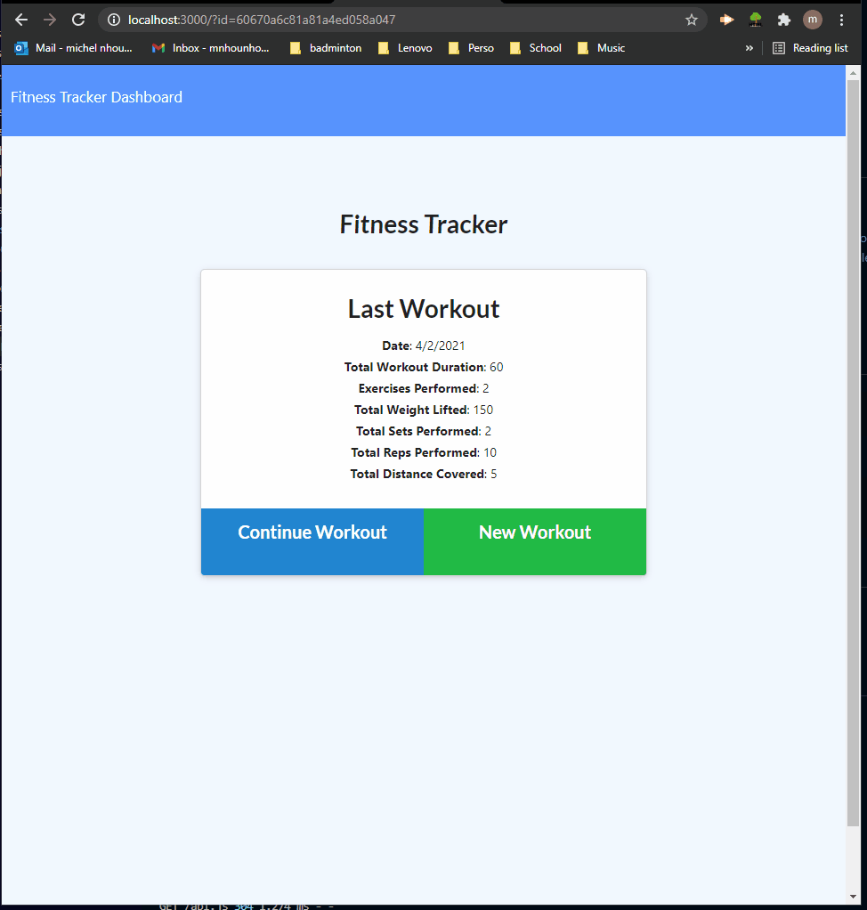

# WorkoutTracker
Daily workout tool management

# Table of Content
- [Overview](#overview)
    - [User Story](#user-story)
    - [Business Content](#business-content)
- [Installation](#installation)
- [Links](#links)
    - [Heroku Deployement](#heroku-deployement)
    - [Github Repo](#github-repo)
- [Screen Shot](#screen-shot)

# Overview
## User Story
- As a user, I want to be able to view create and track daily workouts. I want to be able to log multiple exercises in a workout on a given day. I should also be able to track the name, type, weight, sets, reps, and duration of exercise. If the exercise is a cardio exercise, I should be able to track my distance traveled.
## Business Content
- A consumer will reach their fitness goals more quickly when they track their workout progress.

# Installation
```
npm install
```

To Insert seeds data
```
cd seeders
node seeds.js
```

# Links
## Heroku Deployement
- [Deployement](https://workouttrackerunc.herokuapp.com/)
## Github Repo
- [repo folder](https://github.com/nhounhou/WorkoutTracker)

# Screen Shot
